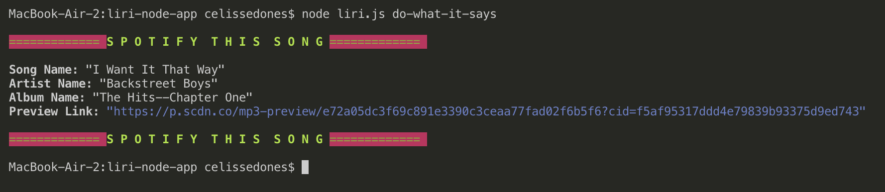
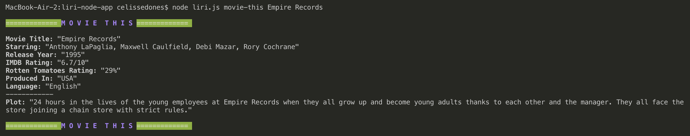
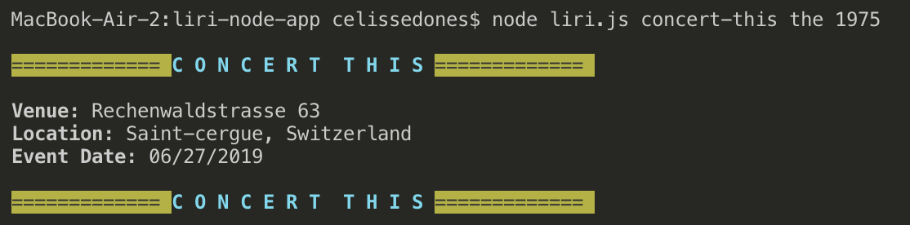
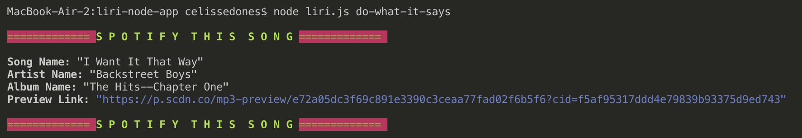

# liri-node-app
LIRI node application. This application was built as part of the UCF Coding Bootcamp. This is Homework Assignment #10 and was authored by Celisse Dones.

# Overview
LIRI is a command line virtual assistant that listens for a a text based user command, and returns information from the Bands in Town API, Online Movie Database (OMDB) API, and Spotify API.

# Cloning
In order to clone this repo, you will need to provide your own .emv file that holds keys for the Spotify API.

# User Commands
### // <b>concert-this [artist]</b>
returns upcoming concert dates and venues from Bands in Town API.

### // <b>spotify-this-song [song name]</b>
returns Song Name, Artist Name, Album Title, and Preview Link from Spotify API. 
If no [song name] is entered, will return default search for "The Sign" by Ace of Base.

### // <b>movie-this [movie name]</b>
returns Movie Name, Release Year, IMDB and Rotten Tomatoes ratings, Country of Production, and Language, from OMDB API. 
If no [movie name] is entered, will return default search for "Mr. Nobody."

### // <b>do-what-it-says</b>
returns search result from random.txt file. Run this command to get info on the best song ever written. 🤪

# Screenshots
  
  
  

# Technologies Used
<ul>
    <li>JavaScript</li>
    <li>Spotify API</li>
    <li>Bands in Town API</li>
    <li>OMDB API</li>
    <li>node.js</li>
</ul>

<ul>Node Modules:
    <li>Chalk</li>
    <li>Axios</li>
    <li>Moment</li>
</ul>

